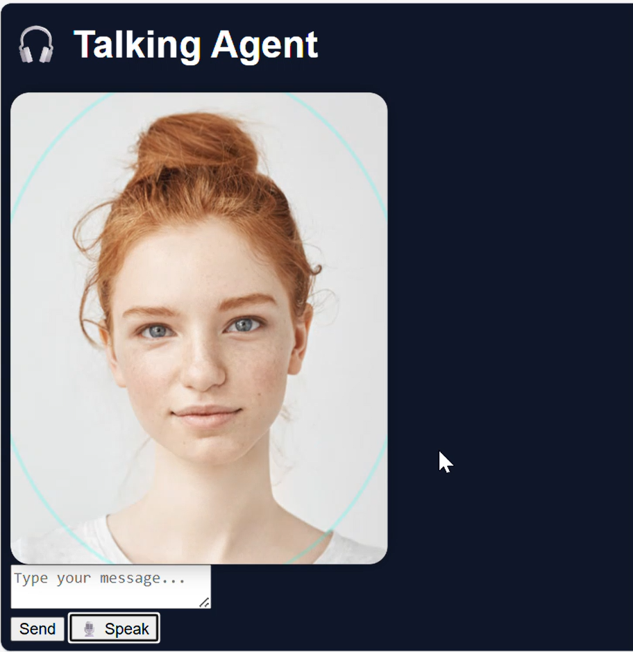

# Welcome to SpeakBuddy

**Demo Video:**  

download here: demo_video\speakBuddy.mp4

YT link: https://youtube.com/shorts/WIxpIc-X04Q?feature=share



---

## Detailed Description to Use This Repo in Cloud GPU

For this **SpeakBuddy** project, I have used the **RunPod GPU instance (RTX 4000 Ada, 20GB VRAM)**.

If you want to run or improve this project:
- Connect your **RunPod GPU instance** to **VS Code** for faster execution and model performance.
- Follow the setup steps below.
YT link: https://youtu.be/Q5r0SayNWg0?si=Xcl0IGVxZ1C3vpxx
---

## Working Model of SpeakBuddy

This is a general-purpose **talking AI model** that supports both **speech** and **text input**.  
The architecture is built using open-source models:
```
 Functionality        - Model Used 

 Speech-to-Text (STT) - Whisper 
 Text-to-Speech (TTS) - Coqui-TTS 
 LLM Text Generation  - LLaMA-3 (via Groq Platform) 
```
---

## Setup Instructions


```bash
# Step 1: Create and Activate a Virtual Environment
cd speakBuddy

python3.9 -m venv myenv

source myenv/bin/activate

#step 2: Install Required Packages
pip install -r requirements.txt

# Run The Application
uvicorn main:app --reload --host 0.0.0.0 --port 8000

```

Note:
Kudos to the open-source communities behind these models for their valuable research contributions.

---